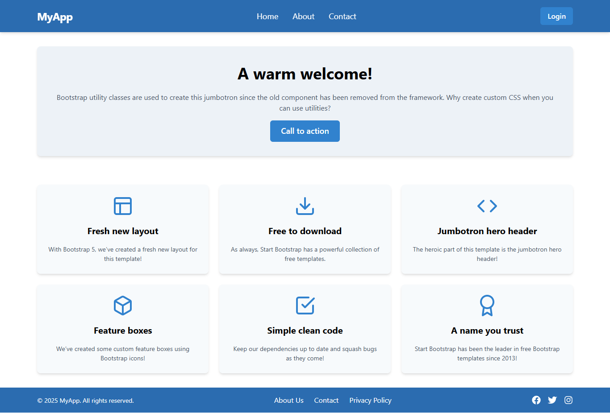

# Main Exercise ReactJS 1



## Introduction

Welcome to this simple ReactJS project! 🎉 This is an exciting journey designed specifically for those who want to explore and master the fundamental concepts of ReactJS through hands-on practice. The project focuses on breaking down the interface into basic components like Header, Banner, Footer, and more, helping you understand how to build and manage interface blocks in a modern web application.

## Features

- **Component Segmentation**: Master the art of creating distinct components within a layout and effectively utilizing them to build modular, reusable, and maintainable user interfaces.
- **Responsive Design**: Ensure a seamless and visually appealing experience across various screen sizes, from mobile devices to desktops, with adaptive and flexible layouts.

## Setup

Follow these steps to set up and run the project locally:

1. **Clone this repository:**

   ```bash
   git clone https://github.com/minh-dev1801/exercise_js_2.git

   ```

2. **Launch the application:**

   ```bash
   npm run dev

   ```

## Technologies Used

- **Chakra UI**: A lightweight, efficient framework for building sleek and responsive user interfaces.
- **React Icon**: An optimized collection of icons for enhancing visual elements in React applications.
